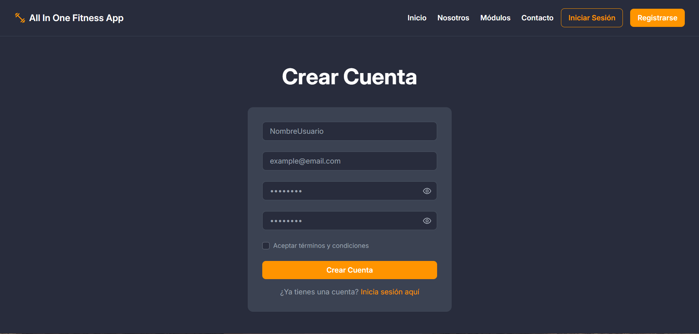
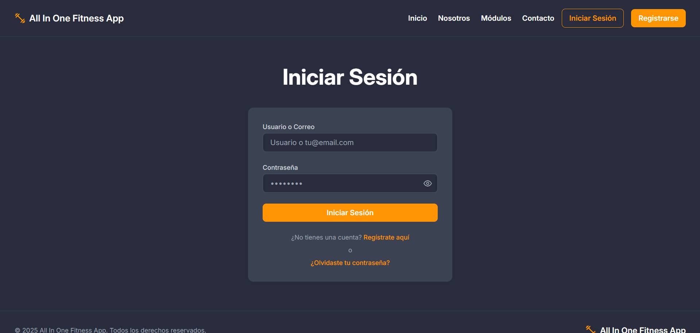
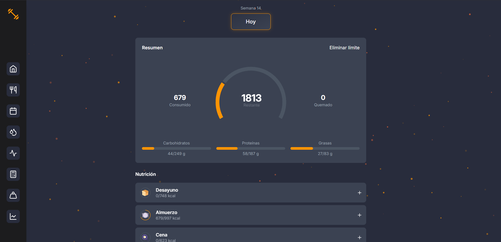
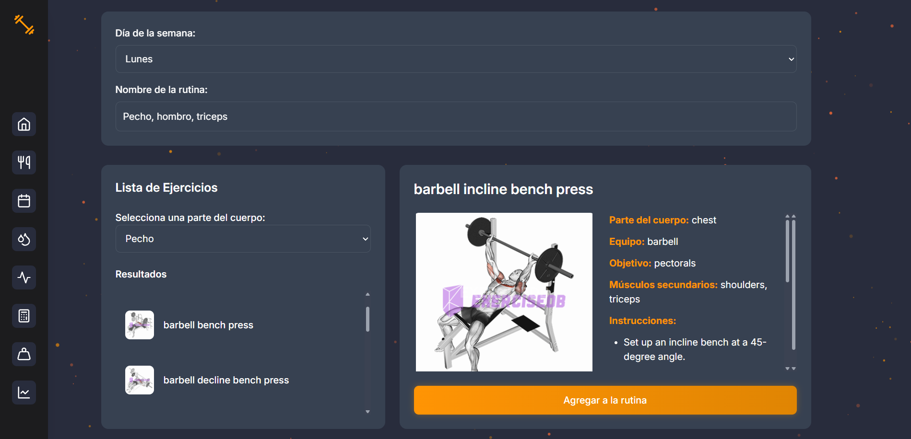
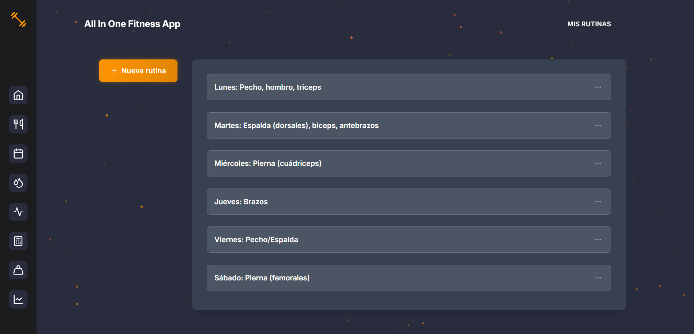
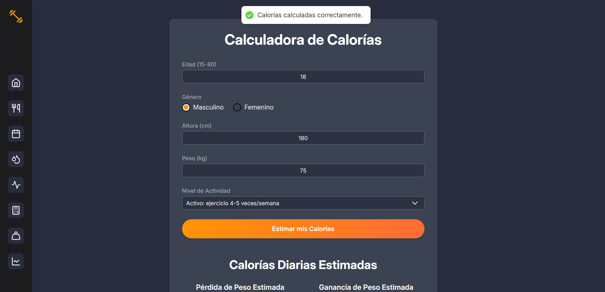
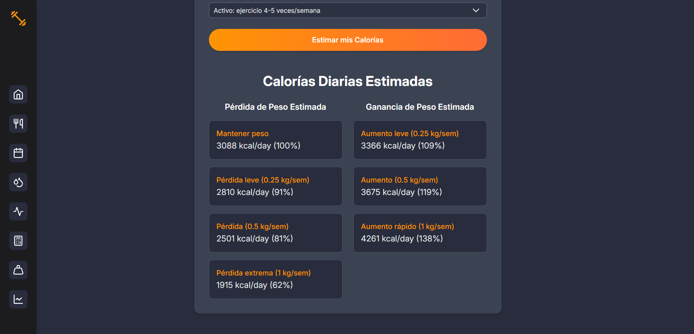
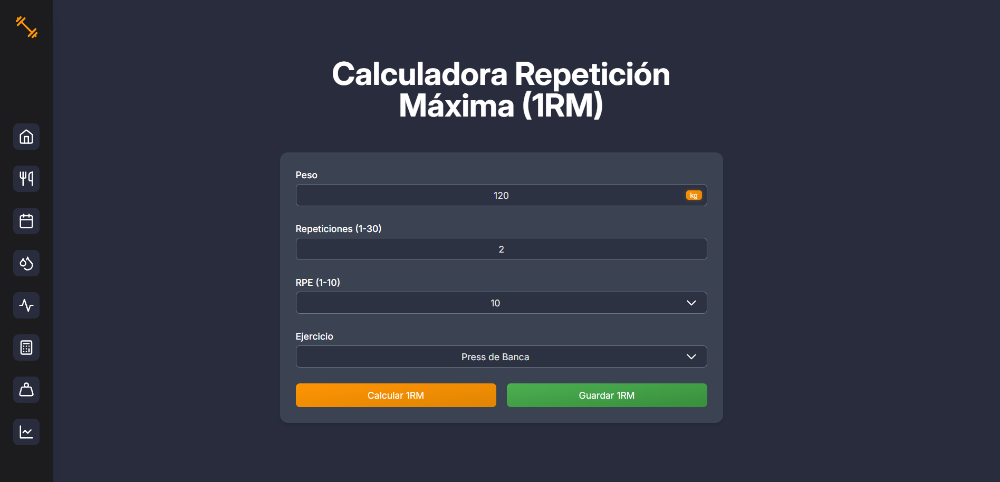

# **All In One Fitness App**

Aplicación web diseñada para ayudar a los usuarios a gestionar sus **hábitos saludables o proceso de acondicionamiento físico**. All In One Fitness ofrece características como el **seguimiento de las calorías y
macronutrientes de los alimentos registrados**, el **registro de ejercicios y peso levantado durante el entrenamiento de fuerza**, el **seguimiento de hidratación**, **calculadora de calorías**, **calculadora de repetición máxima** y muchas más funcionalidades.

## Tecnologías Utilizadas

### Frontend

- **Framework:** React + Vite
- **Lenguaje:** TypeScript
- **Estilos:** Tailwind CSS
- **Animaciones:** Framer Motion, Swal Alert 2

### Backend

- **Lenguaje:** TypeScript
- **Framework:** Node.js con Express
- **Base de Datos:** Supabase

## Características Principales

### Usuario

- **Registro** e **inicio de sesión**.

- Dashboard que muestra el resumen de la **ingesta diaria de calorías** y permite el acceso rápido para el **registro de alimentos**.

- Registro de **ejercicios** y **peso levantado**.

- Rutinas a la medida.

- Calculadora para **estimar el número de calorías según el objetivo del usuario**.

- Calculadora para **estimar el número de repeticiones que el usuario puede hacer con un determinado peso**.

- Control sobre la **hidratación**.

## Desarrolladores

- [Camilo Marín Muriel](https://github.com/MarinNoSkill)
- [Daniel Ortiz Aristizábal](https://github.com/dano796)
- [Emanuel Londoño Osorio](https://github.com/Emanuel0428)
- [Felipe Torres Montoya](https://github.com/FelipeTM25)
